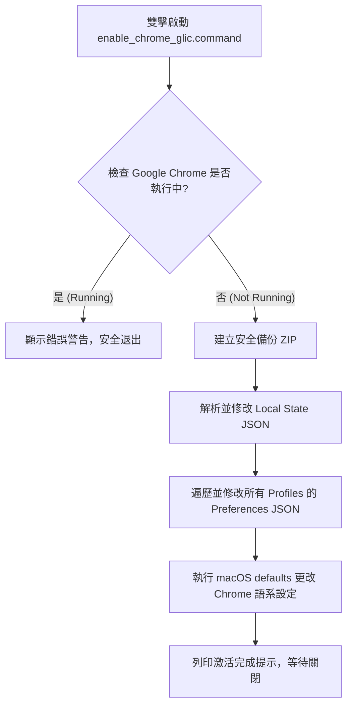

# Chrome Glic (Gemini Chrome) 啟用與修復專案教學

本教學旨在說明如何透過手動與自動化腳本，在 macOS 上強制開啟 Google Chrome 的新一代 AI 語音與桌面助手功能 **Glic (Google Lite/Live Interactive Card)**。

> [!IMPORTANT]
> **技術聲明與誌謝**  
> 本專案的完整底層環境診斷、參數交叉比對、安全備份邏輯以及最終「一鍵雙擊修復」工具的程式開發，均是由優秀的 AI 編碼助理 **Google Antigravity** 獨立分析與實作完成。憑藉 Antigravity 強大的自動化探查能力，才能在不損壞用戶 Chrome 原有數據的情況下，快速且安全地解鎖此項隱藏功能。

---

## 1. 專案背景與運作原理

### 什麼是 Chrome Glic？
Chrome Glic 是 Google Chrome 的一項實驗性 AI 助理介面。它能以獨立視窗（甚至跨出瀏覽器）存在於桌面，提供系統級快捷鍵（`Option + Space`）呼叫，並支援讀取當前分頁、螢幕擷取、跨應用程式協同工作等深度 AI 功能。

### 為什麼預設無法在台灣使用？
Google 目前將 Glic 與 Chrome AI 設定限制在**特定地區（主要是美國 US）**與**英文語系（en-US）**。如果你的 macOS 系統語言為中文，或者 Chrome 從台灣 IP 啟動，Chrome 會自動將你的環境識別為非資格區域，並關閉對應的設定頁面 (`chrome://settings/ai`) 和界面入口。

---

## 2. 設定參數對照表：原本 vs 修改後

開啟 Glic 不是單一開關決定的，而是由 **macOS 應用程式預設值**、**Chrome 全局狀態 (`Local State`)** 以及 **Chrome 用戶設定 (`Preferences`)** 三者共同構成的生態鏈。

### 2.1 全域參數對照 (`Local State`)

| 參數鍵名 (JSON Path) | 原本狀態 (台灣/中文) | 修改後狀態 (啟用 Glic) | 說明 |
| :--- | :--- | :--- | :--- |
| `variations_country` | `"tw"` | `"us"` | 強制宣告當前瀏覽器地區為美國 |
| `variations_safe_seed_permanent_consistency_country` | `"tw"` | `"us"` | 防止 Chrome 透過種子回寫地區 |
| `variations_safe_seed_session_consistency_country` | `"tw"` | `"us"` | 確保單次 Session 地區判定為美國 |
| `variations_safe_seed_locale` | (無或非 `"en-US"`) | `"en-US"` | 安全變量語系設為美式英文 |
| `glic.is_glic_eligible` | `false` (或無) | `true` | 開啟 Glic 全局適用資格 |
| `glic.launcher_enabled` | `false` (或無) | `true` | 開啟 Glic 啟動器 |
| `profile.info_cache.*.is_glic_eligible` | `false` (或無) | `true` | 將所有用戶 Profile 標記為有資格使用 Glic |
| `variations_sticky_studies` | 不含 Glic 項目 | 包含 `GlicSummarizeVideoSuggestion/Default` | 強制綁定 Glic 影片摘要等實驗研究項目 |

### 2.2 實驗功能旗標 (`browser.enabled_labs_experiments`)
在原本狀態下，實驗旗標可能全無或只有少數幾個。啟用 Glic 必須**同時集齊以下 8 個實驗 flags**：

1. `glic@1` (主程式開關)
2. `glic-actor@1` (AI 核心行為)
3. `glic-button-pressed-state@1` (按鈕交互)
4. `glic-default-to-last-active-conversation@1` (預設回到前次對話)
5. `glic-entrypoint-variations@1` (入口多樣性)
6. `glic-side-panel@1` (側邊欄支援)
7. `glic-unified-fre-screen@1` (首次使用體驗導引介面)
8. `ai-settings-page@1` (**關鍵啟動旗標**：控制 `chrome://settings/ai` 路由初始化的開關)

### 2.3 用戶 Profile 偏好設定 (`Preferences`)

| 參數鍵名 (JSON Path) | 原本狀態 | 修改後狀態 | 說明 |
| :--- | :--- | :--- | :--- |
| `intl.accept_languages` | `"zh-TW,zh"` | `"en-US,en"` | 用戶 Profile 首選接受語言 |
| `intl.selected_languages` | `"zh-TW,zh"` | `"en-US,en"` | 用戶 Profile 當前選定語言 |
| `spellcheck.dictionaries` | `["zh-TW"]` (或空) | `["en-US"]` | 拼字檢查字典改為英文 |

### 2.4 macOS 應用程式層級語言
透過 macOS `defaults` 寫入，只改變 Chrome 單一應用的語系，不干涉系統全域語言：
* `com.google.Chrome AppleLanguages` -> `["en-US"]`
* `com.google.Chrome AppleLocale` -> `"en_US"`

---

## 3. 程式運作流程與邏輯剖析

我們所使用的 `enable_chrome_glic.command` 是一隻**自包含（Self-contained）的 Bash + Python 自動化指令檔**。它的執行步驟如下：

### 備份安全性設計
每次執行修改時，程式都會在同層的 `backup/` 目錄中，自動打包一個帶有精確時間戳記的備份檔，如 `safety_backup_2026-06-03_10-33-17.zip`。
> [!TIP]
> 如果未來發生任何設定異常，你只需解壓縮該備份，並覆蓋回 `~/Library/Application Support/Google/Chrome` 目錄，即可 100% 還原瀏覽器原狀。

---

## 4. 如何運用這隻程式？（實操手冊）

### 4.1 準備工作
1. 確保已安裝 Python 3（macOS 通常內建）。
2. 下載或定位到本工具目錄下。
3. **非常重要**：請按下 `Cmd + Q` **完全關閉 Google Chrome**，確保 Dock 欄下方的 Chrome 圖示下沒有小黑點。

### 4.2 執行啟用
1. 在 Finder 中，找到 [enable_chrome_glic.command](file:///Users/yinlincheng/AI-Code-mobile/chrome_gemini_transfer/Agent_news/gemini_chrome/tools/enable_chrome_glic.command)。
2. **雙擊執行**該檔案。系統會自動打開終端機（Terminal）並完成修改。
3. 執行成功後，終端機會顯示 `Activation Patch Completed Successfully!`。此時按下 Enter 鍵關閉視窗即可。

### 4.3 首次啟動與激活 (關鍵步驟)
修改完成後，請**務必按照以下順序**進行首次啟動：

1. **開啟 US VPN**：連接至美國 VPN 節點。
2. **啟動 Google Chrome**：此時 Chrome 介面會變成英文版。
3. **登入與體驗**：
   * 在網址列輸入 `chrome://settings/ai`，你會發現 AI 設定頁面已成功出現。
   * 查看右上角或工具列，Glic 的圓形圖標或側邊欄小精靈應該已經就緒。
   * 點選它完成首次使用的 FRE (First Run Experience) 引導流程。

### 4.4 日常使用
* **無需持續開啟 VPN**：首次激活成功後，Chrome 會在本地記錄已啟用狀態。此時你可以關閉 VPN，之後即使在台灣本地網絡下，Glic 設定與功能也依然會保持啟用。
* **如果功能消失了怎麼辦？**：當 Chrome 進行大版本更新（例如從 v149 升級）時，有時會自動重設你的 `Local State` 與實驗 flags。這時你只需**再次雙擊執行該程式**，即可在 3 秒內重新武裝所有參數，重新找回 Glic 功能！

---

## 5. 專案目錄結構指引

* [tools/enable_chrome_glic.command](file:///Users/yinlincheng/AI-Code-mobile/chrome_gemini_transfer/Agent_news/gemini_chrome/tools/enable_chrome_glic.command) : 一鍵修復與啟用主程式（已賦予執行權限）。
* [tools/inspect_chrome_ai.py](file:///Users/yinlincheng/AI-Code-mobile/chrome_gemini_transfer/Agent_news/gemini_chrome/tools/inspect_chrome_ai.py) : 用於隨時讀取、列印目前本機 Chrome Glic 各項參數值的檢測工具。
* [backup/](file:///Users/yinlincheng/AI-Code-mobile/chrome_gemini_transfer/Agent_news/gemini_chrome/backup) : 自動備份資料夾，存放修復前所打包的備份 ZIP 檔案。
* [MACAIR_GLIC_PARAMETER_WORKFLOW.md](file:///Users/yinlincheng/AI-Code-mobile/chrome_gemini_transfer/Agent_news/gemini_chrome/MACAIR_GLIC_PARAMETER_WORKFLOW.md) : 實驗期間的歷史分析與參數研究紀錄。

---

## 6. 版權與協作聲明

* **版權所有**：Copyright © Falo x Force Chent 2026/6/1. All rights reserved.
* **研發協助**：本專案之全盤環境診斷、邏輯實作與自動化修復工具均與優秀的 AI 助理 **Google Antigravity** 協作完成。

<!-- Copyright © Falo x Force Chent 2026/6/1. All rights reserved. -->

